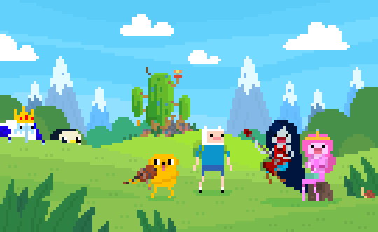

<!--
  Asset note:
  - assets/header.gif is a forest-green animated placeholder generated for this package.
    Replace it with the selected Pokémon GIF while keeping the same filename.
  - assets/achievement.gif is a personalized pixel-art placeholder.
    Replace it with the selected Adventure Time GIF while keeping the same filename.
-->

  

  
  

<h1 align="center">Hi, I'm Raditya 👋</h1>

  <strong>Software Engineering Student · Independent Developer · Technology Explorer</strong>

  I am currently studying Software Engineering at SMK Negeri 1 Denpasar.
  As an independent developer, I enjoy building websites and applications
  that solve practical problems and help people around me.

  I am always curious about new technologies—especially artificial intelligence,
  automation, operating systems, web technologies, IoT, and modern development tools.
  I keep learning through projects, experiments, documentation, and collaboration.

  
  
  

  
  

<h2>🌊 About Me</h2>

- 🎓 Software Engineering student at **SMK Negeri 1 Denpasar**
- 💻 Independent developer who enjoys building projects from idea to implementation
- 🌱 Currently improving my web and application development skills
- 🧠 Interested in AI agents, automation, IoT, frameworks, and operating systems
- 🛠️ I enjoy turning ideas into practical and maintainable digital products
- 📚 Constantly learning through projects, experiments, and technical documentation
- 🤝 Interested in creating technology that can help people around me

<h2>🏆 Achievements</h2>

- 🥈 **2nd Place** — City-Level LKS Web Technologies, 2026
- 🏅 **Juara Harapan I** — LCC Computer, 2024
- 🏅 **Juara Harapan I** — LCC Computer, 2025

<h2>🔭 Areas of Interest</h2>

- 🤖 Artificial Intelligence, AI systems, and AI agents
- ⚙️ Automation and efficient digital workflows
- 🌐 Web technologies, responsive interfaces, and accessibility
- 🐧 Operating systems, Linux, terminal tools, and computer fundamentals
- 🔌 Internet of Things and connected devices
- 🧩 Modern frameworks, development tools, and software architecture

 

<h2>🚀 Featured Projects</h2>

<table>
  <tr>
    <td width="33%" valign="top">
      <h3>🥗 NutLens</h3>
      

        An AI-assisted nutrition education website that helps users understand
        food and discover healthier alternatives.
      

      <a href="https://github.com/nomarrie/nut-lens">
        <strong>View Repository →</strong>
      </a>
    </td>
    <td width="33%" valign="top">
      <h3>🧪 Eksperika</h3>
      

        An interactive virtual laboratory that makes Physics, Chemistry,
        and Biology experiments more accessible through the web.
      

      <a href="https://github.com/nomarrie/eksperika">
        <strong>View Repository →</strong>
      </a>
    </td>
    <td width="33%" valign="top">
      <h3>📚 Tasku AI</h3>
      

        An intelligent task and study planner for managing deadlines,
        learning plans, progress, and focused study sessions.
      

      <a href="https://github.com/nomarrie/tasku-ai">
        <strong>View Repository →</strong>
      </a>
    </td>
  </tr>
</table>

<h2>🧰 Tech Stack</h2>

  These are some of the technologies and tools I use or am currently learning:

  
  
  
  
  
  
  
  
  
  
  
  

<h2>🌌 GitHub Activity</h2>

<table align="center">
  <tr>
    <td width="50%" valign="top">
      
    </td>
    <td width="50%" valign="top">
      
    </td>
  </tr>
</table>

  

  <em>Learning one project, one experiment, and one challenge at a time.</em>

